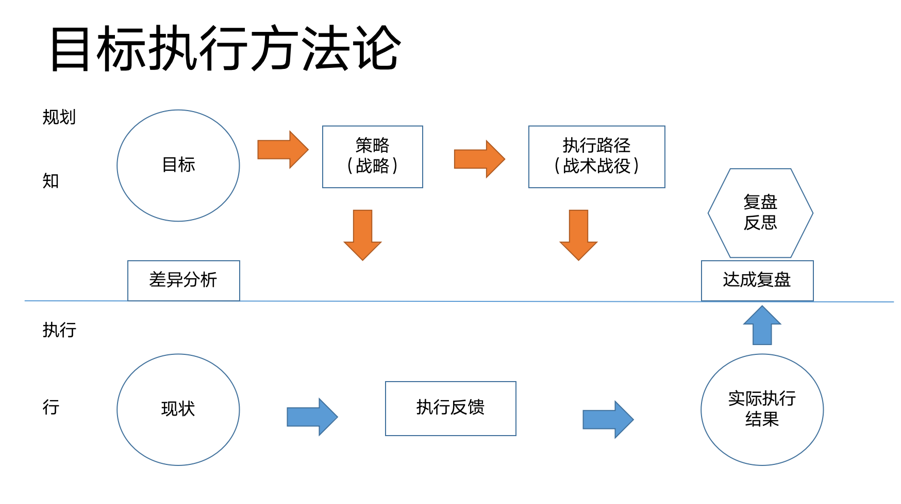

### 前言

### 目录
#### 1.做事方法论结构图总结
#### 2. 做事核心步骤
#### 3. 目标
#### 4. 现状 
#### 5. 策略
#### 6. 执行路径
#### 7. 结果复盘

### 1.做事方法论结构图总结

	做事方法方法论，我们阐述说明的就是在一个高维的视角下，去看我们每做一件事情的核心构成要素是什么，掌握了核心要素和结构，我们就能辅助分析我们工作中遇到的每件事，做好每件事情，对于我们职业规划，能力提升都有很好的指导意义。

### 2.做事核心步骤
	从架构图中，我们能看到 最为和新的要素有：
	1. 目标
	2. 现状
	3. 策略
	4. 执行路径
	5. 执行反馈
	6. 结果复盘
   
#### 3. 目标   
	3.1 目标的重要性
	总体的意义就是，我们做任何事情，包括大的人生，职业规划，职场，生活  ； 小的如出差，旅游  都要有目标；

	没有目标的人，犹如热锅上的蚂蚁，做事急的团团转，但却没有一点办法应对目前遇到的问题；

	没有目标的人，犹如进入迷宫一样，做事分不清轻重缓急，找不抓手，摸不清入口，事情乱做一气，简直出力不讨好；

	没有目标的人 。。。。 

	3.2 目标从哪里来
	我们再来进一步探讨下，目标是如何制定，以及制定目标的依据是从哪里来 的？  我们每个人都有自己独一无二的大脑，成长环境，从小接受了很多信息。 这个里面最终培养出的是： 价值观。 

	（如果你对 这个词语无感，没有概念，说明你没有价值观的概念，但不能说明你没有价值挂， 儒家思想，佛教，父母的耳濡目染，当地的风俗，在你脑海里 显然都训练除了一种价值观 模型）

	价值观的具体体现是价值判断：
	是么是好坏？
	什么是善恶？
	什么是多少？
	什么是美丑？
	什么是道德与不道德？
	什么是高低贵贱？

### 4. 现状

### 5. 策略
### 6. 执行路径
#### 7. 结果复盘

有了目标之后，我们就要讨论我们的目标和现状的差距是什么？差距有多大？
知道差距后，我们就要制定策略，

