# 1.4 目标执行方法论

### 一、目录
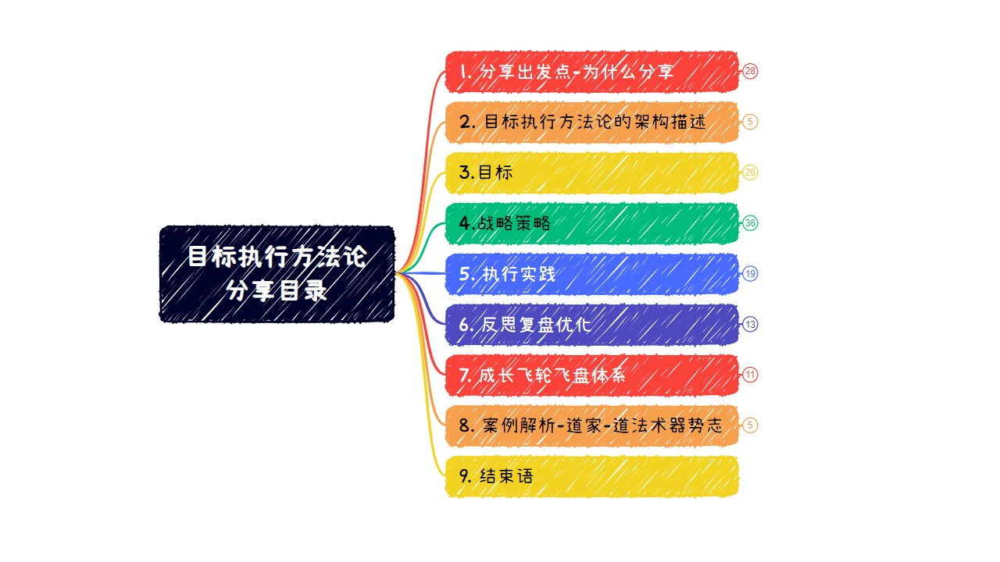

### 二、为什么分享“目标执行方法论”
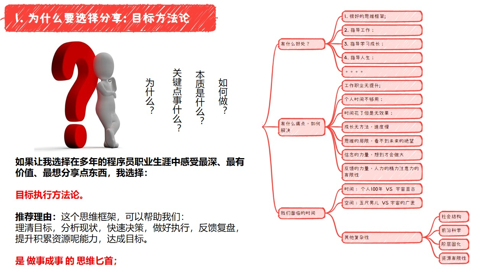

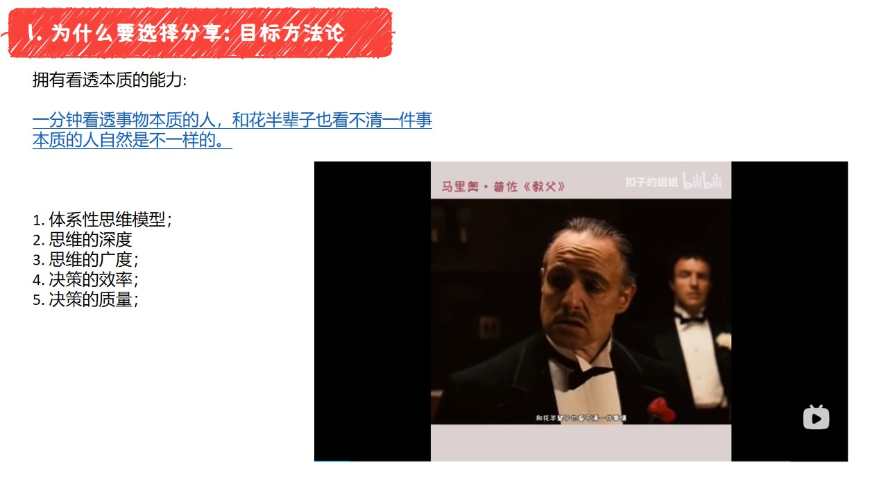

### 三、架构图
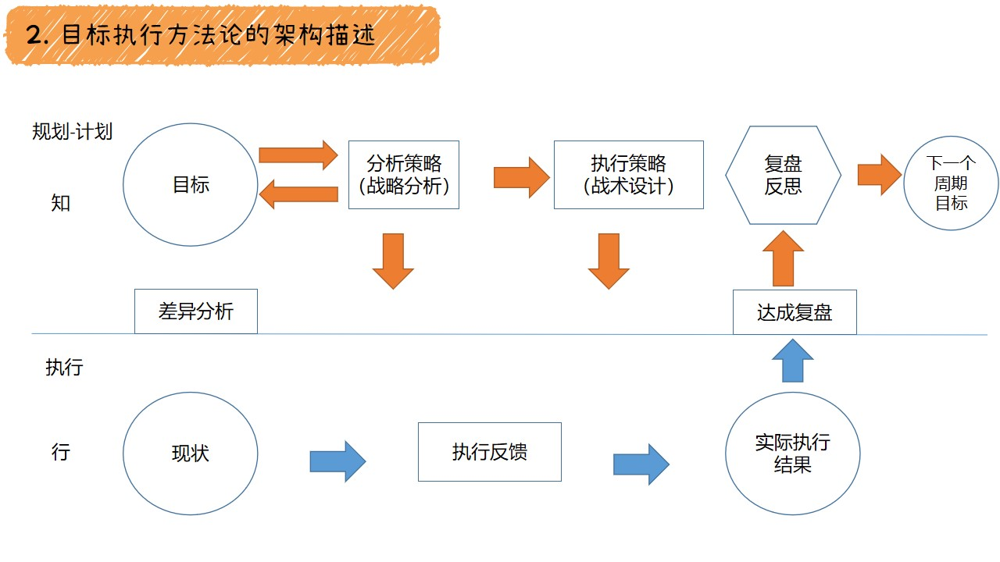

### 四、目标
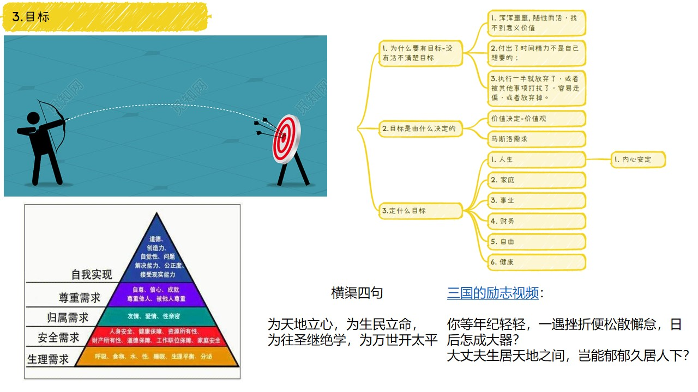
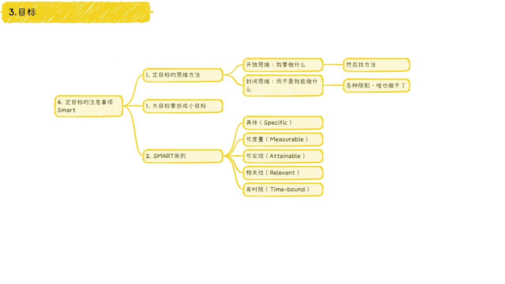

### 五、战略策略
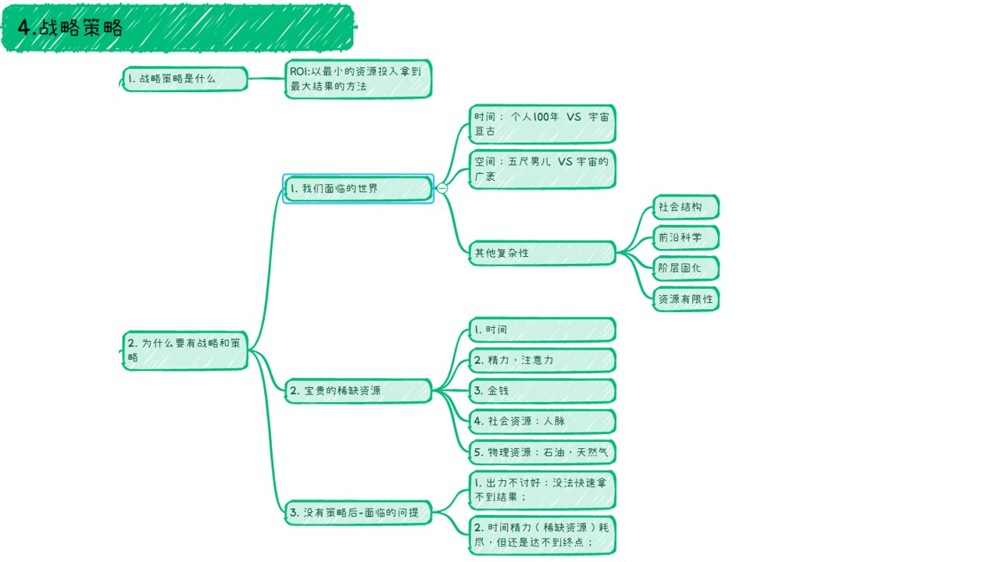
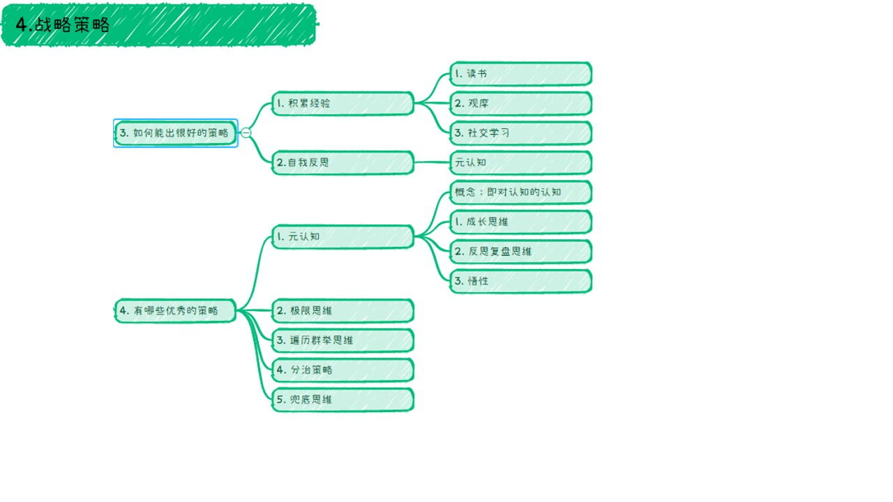

### 六、执行实践

### 七、反思复盘优化
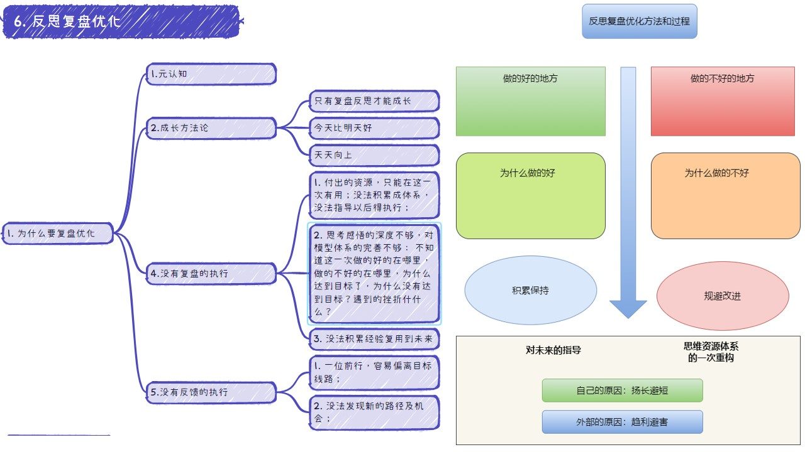

### 八、成长飞轮飞盘体系
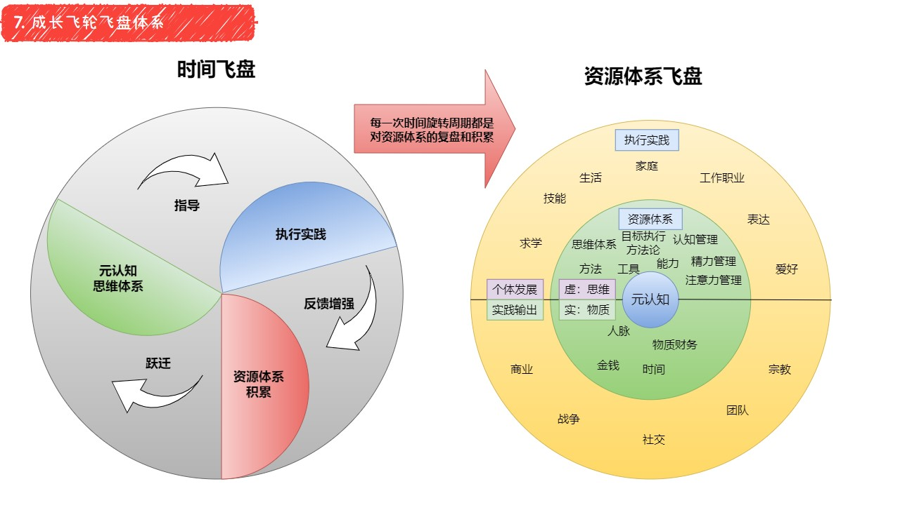

### 九、案例解析

#### 9.1 项目管理:
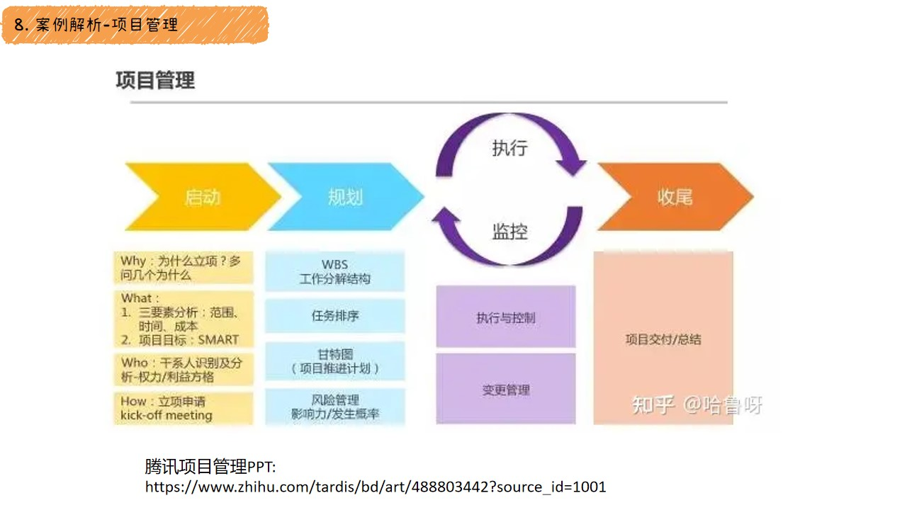

#### 9.2 技术成长方法论:
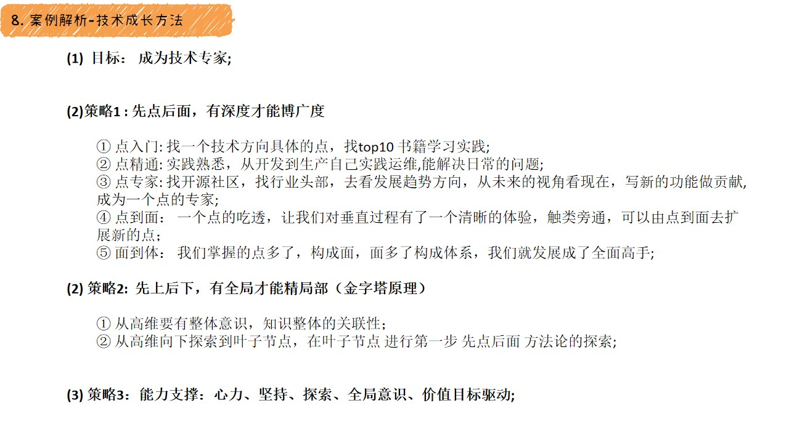

#### 9.3 孙子兵法:
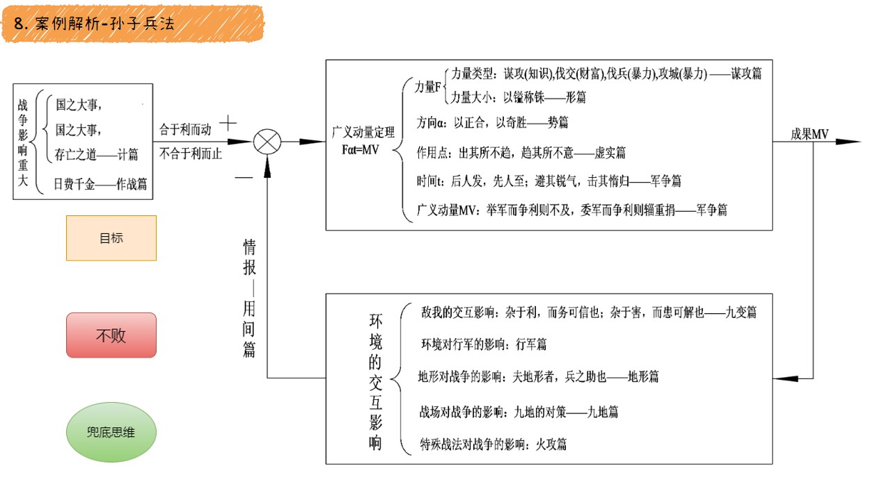

#### 9.4 道家-道法术器势志:
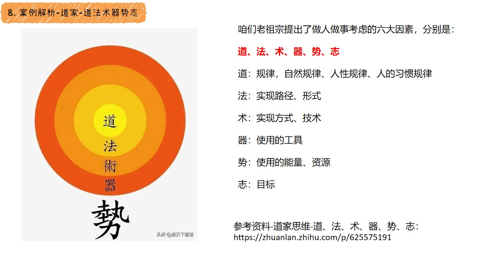

### 十、学习书单-推荐

### 十-、结束语
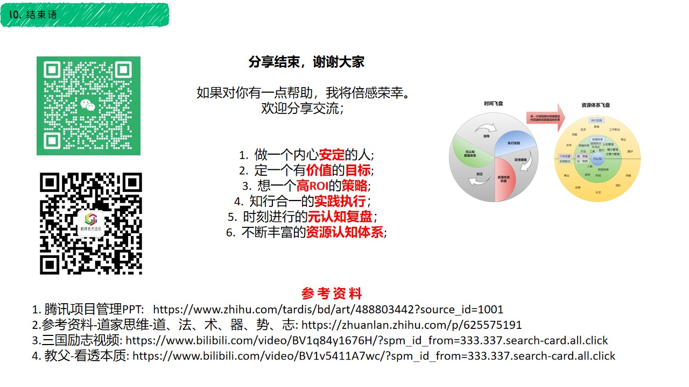

### 程序员方法论
<iframe src="../static/banner_down.html" width="100%" height="300" frameborder="0" scrolling="no"></iframe>