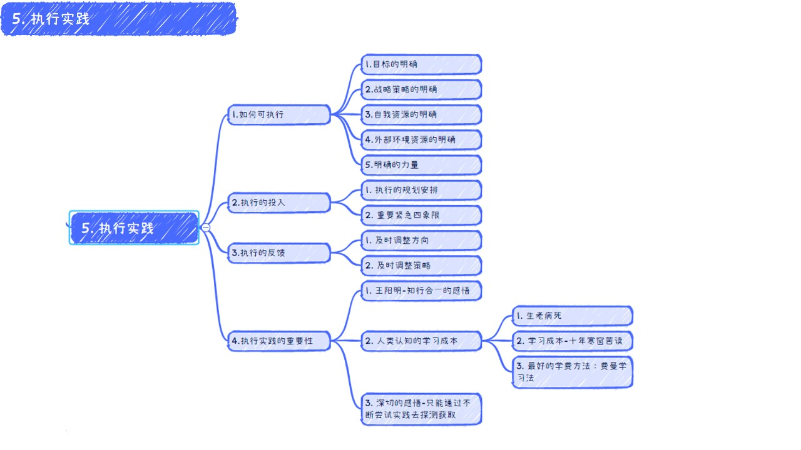
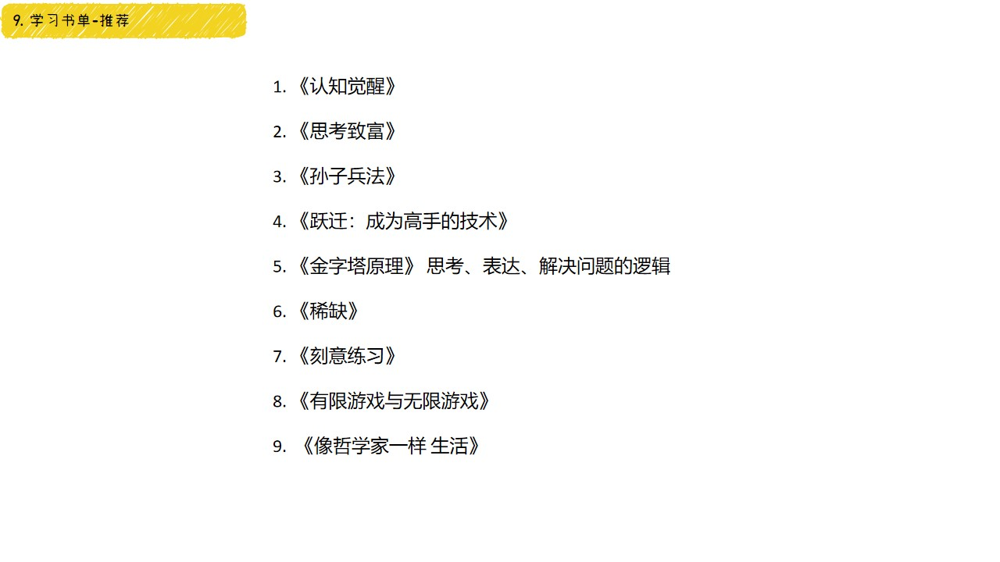

# 1.4 目标执行方法论

### 一、目录

### 二、为什么分享“目标执行方法论”

### 三、架构图

### 四、目标

### 五、战略策略

### 六、执行实践

### 七、反思复盘优化

### 八、成长飞轮飞盘体系

### 九、案例解析

#### 9.1 项目管理:

#### 9.2 技术成长方法论:

#### 9.3 孙子兵法:

#### 9.4 道家-道法术器势志:

### 十、学习书单-推荐

### 十-、结束语

### 程序员方法论
<iframe src="../static/banner_down.html" width="100%" height="300" frameborder="0" scrolling="no"></iframe>